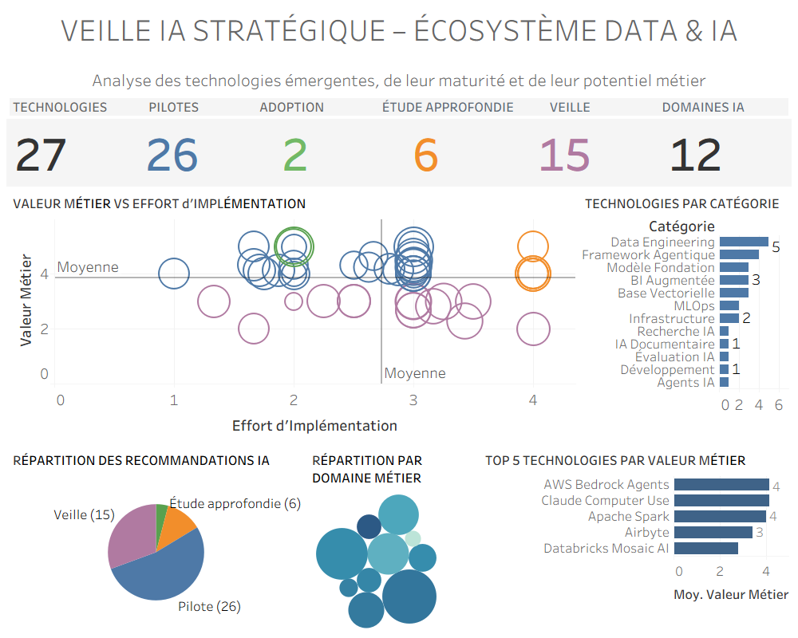

<div align="center">

# Veille IA Stratégique – Écosystème Data & IA

### Tableau Dashboard · AI Technology Watch · Strategic Prioritization


**Interactive dashboard:**  
[View on Tableau Public](https://public.tableau.com/app/profile/sabrina.palis/viz/veille_ia_strategique/Tableaudebord1?publish=yes)

</div>

---

## Overview

This Tableau dashboard presents a strategic technology watch focused on emerging AI, data, and automation technologies. It is designed as an executive-style view for identifying high-potential technologies, comparing business value against implementation effort, and tracking recommendation status across an AI technology portfolio.

The dashboard combines KPI monitoring, prioritization analysis, category distribution, recommendation tracking, and domain-level exploration.

---

## Dashboard Preview



---

## Objectives

The dashboard is designed to answer five practical questions:

1. Which AI and data technologies are currently being monitored?
2. Which technologies are suitable for pilot experimentation?
3. Which technologies show strong business value relative to implementation effort?
4. Which categories and business domains receive the most attention?
5. How is the technology portfolio distributed across adoption recommendations?

---

## Key Metrics

The dashboard includes KPI indicators for:

- Technologies tracked
- Recommended pilots
- Adoption candidates
- Technologies requiring further study
- Watchlist technologies
- AI / data domains covered

---

## Visual Components

### Business Value vs Implementation Effort

A scatterplot positions technologies according to business value and implementation effort. This supports prioritization by distinguishing technologies that are high-value, low-effort, complex, or better suited for monitoring.

### Technologies by Category

A horizontal bar chart shows the distribution of monitored technologies across categories such as Data Engineering, Framework Agentique, Modèle Fondation, BI Augmentée, and MLOps.

### Recommendation Distribution

A recommendation chart summarizes the portfolio across adoption stages:

- Adoption
- Pilote
- Étude approfondie
- Veille

### Business Domain Coverage

A bubble chart visualizes the distribution of technologies across business domains and helps identify which operational or strategic areas are most represented.

### Top Technologies by Business Value

A ranking view highlights technologies with strong business-value potential, supporting quick executive review.

---

## Methodology

Each signal in the dataset is described using a structured technology-watch schema, including:

- Technology name
- Provider
- Category
- Business domain
- Use case
- Business value score
- Implementation effort score
- Maturity score
- Cost and risk indicators
- Strategic priority
- Recommendation
- Analyst note

The dashboard uses these fields to create both descriptive and decision-support visualizations.

---

## Tools Used

- Tableau Desktop / Tableau Public
- Structured CSV / Excel data source
- Manual technology-watch dataset design
- Dashboard layout and KPI design
- Strategic scoring model for AI technology prioritization

---

## Repository Structure

```text
.
├── README.md
├── dashboard_screenshot.png
├── veille_ia_strategique.twbx
└── data/
    └── ai_strategic_technology_watch.csv
```

---

## Portfolio Context

This project demonstrates the ability to move from a structured technology-watch dataset to a usable executive dashboard. It combines data preparation, KPI design, visual analytics, Tableau dashboard assembly, and business-oriented interpretation.

It is intended as a portfolio artifact for roles involving AI consulting, data analysis, business intelligence, AI strategy, technology watch, or data-driven innovation support.

---

## Live Dashboard

The interactive version is available on Tableau Public:

[https://public.tableau.com/app/profile/sabrina.palis/viz/veille_ia_strategique/Tableaudebord1?publish=yes](https://public.tableau.com/app/profile/sabrina.palis/viz/veille_ia_strategique/Tableaudebord1?publish=yes)

